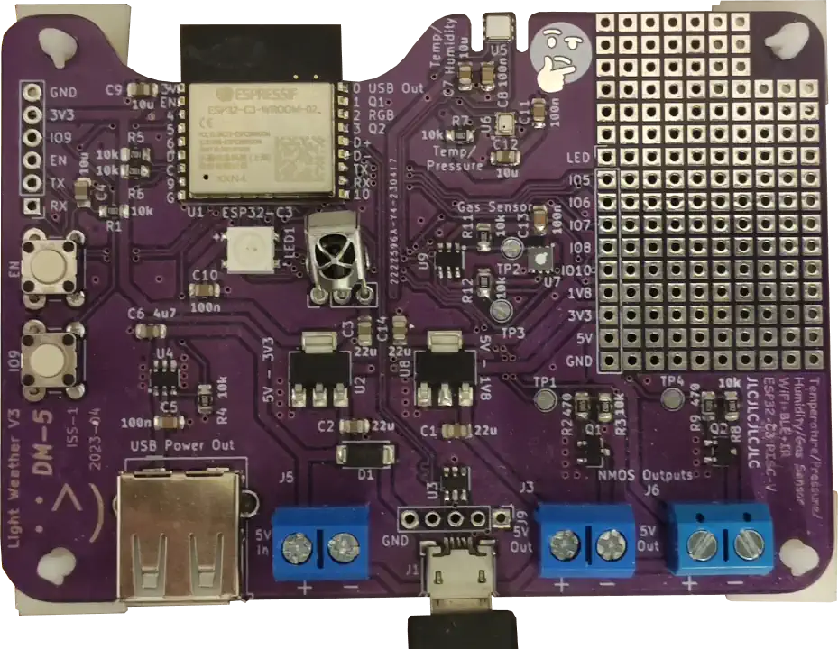

# Light Weather V3

I made a temperature/pressure/humidity/gas sensor and general I/O interface for
my "smart flat".

[Full write-up](https://domson.dev/projects/lightweather.html) of versions 1
through 3 (this version) on my [personal website](https://domson.dev).

It features an ESP32-C3 controlling two NMOS outputs, one current-limited USB A
(power only) output, and an addressable RGB LED. It has pressure, temperature,
humidity, and gas sensors, and an IR receiver. These can be controlled using
MQTT over WiFi, or using an IR remote.

- [Schematic](./pictures/lightweather_schematic.pdf)
- [Firmware](./firmware/)

The hardware and firmware are open-source, the firmware (everything in
the [firmware](./firmware/) directory) is licensed under the
[GPL V3](./firmware/LICENSE).
The hardware (everything else) is licensed under the
[CERN Open Hardware Licence Version 2 - Strongly Reciprocal](./LICENSE).
The general gist is that if you feel like using or modifying anything here,
good luck, have fun, and publish what you make as open-source too.

